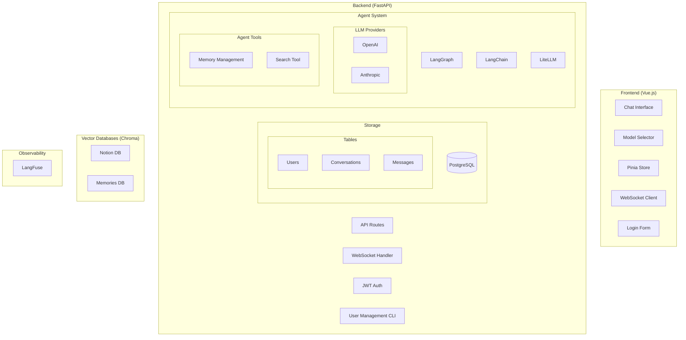

# System Patterns

## Architecture Overview

## Design Patterns

### Pattern 1: Agent-Driven Architecture
- **Purpose**: Centralize all operations through the agent interface
- **Implementation**: LangGraph orchestration with tools
- **Usage**: Memory management, vector search, response generation

### Pattern 2: Pluggable LLM Providers
- **Purpose**: Allow flexible model selection
- **Implementation**: LiteLLM abstraction layer
- **Usage**: Model selection at conversation start

### Pattern 3: Dual Vector Store Strategy
- **Purpose**: Separate read-only knowledge from dynamic memories
- **Implementation**: Two Chroma instances with different access patterns
- **Usage**: Parallel search across both stores

### Pattern 4: WebSocket Streaming
- **Purpose**: Real-time response streaming
- **Implementation**: FastAPI WebSocket endpoints
- **Usage**: Agent responses and status updates

## Component Relationships
- Frontend communicates with backend via REST and WebSocket
- Agent orchestrates all vector store operations
- LiteLLM manages all LLM provider interactions
- PostgreSQL handles all persistent state
- LangFuse monitors all system operations

## Data Flow
1. User sends message via WebSocket
2. Agent receives message through LangGraph
3. Agent performs parallel vector search
4. LLM generates response via LiteLLM
5. Response streams back through WebSocket
6. Conversation stored in PostgreSQL
7. All operations logged to LangFuse

## Key Technical Decisions

### Decision 1: Vue.js Frontend
- **Context**: Need flexible, robust UI
- **Decision**: Use Vue.js over Gradio/Streamlit
- **Consequences**: More setup but greater flexibility

### Decision 2: FastAPI Backend
- **Context**: Need async support for vector operations
- **Decision**: Use FastAPI for backend
- **Consequences**: Good typing, docs, and performance

### Decision 3: LangGraph Integration
- **Context**: Need agent orchestration
- **Decision**: Use LangGraph over direct LangChain
- **Consequences**: Better flow control and state management

### Decision 4: Simplified Auth
- **Context**: Small user base, no self-service needed
- **Decision**: JWT with CLI management
- **Consequences**: Simpler implementation, manual user management

## Security Patterns
- JWT for authentication
- Environment variables for secrets
- Read-only access to Notion store
- Manual user management
- No public registration

## Error Handling
- LangFuse error tracking
- WebSocket error recovery
- Database transaction management
- LLM error retry logic

## Performance Considerations
- Parallel vector search
- WebSocket streaming
- PostgreSQL indexing
- Efficient agent state management

## Testing Patterns
- Unit tests for tools
- Integration tests for agent
- WebSocket connection testing
- Authentication flow testing

## Integration Patterns
- LangChain for vector stores
- LiteLLM for model management
- LangFuse for monitoring
- PostgreSQL for persistence
